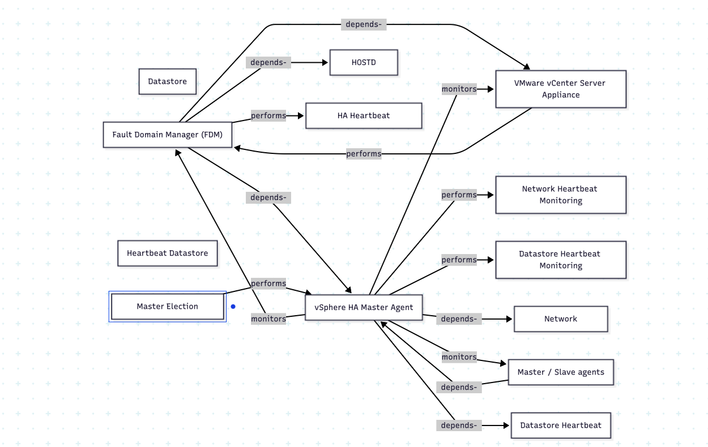

# kg-extract

Typed knowledge-graph extraction over technical documentation. Demonstrates that
graph traversal over a corpus answers cross-section dependency questions
vanilla RAG cannot reconstruct.

Companion blog: [From Retrieval to Synthesis](https://systems-ai.hashnode.dev)

---
## Demonstration on a real corpus

Extracted from a 300-page technical reference. Total cost ~$3 in OpenAI credits.
Resulting graph: **1,526 entities, 1,474 typed relations** across 12 predicates.

### Component-interaction diagram (auto-generated from the graph)



Each edge is a typed predicate (`depends-on`, `performs`, `monitors`, ...)
with provenance back to the source section. Diagram source:
[`examples/ha_component_diagram.mmd`](examples/ha_component_diagram.mmd) —
GitHub also renders this natively as a Mermaid graph.

### Sample cross-section query

```bash
$ uv run python graph_build.py --path comp.drs comp.admission_control
```
Full output: [`examples/path_drs_to_admission.png`](examples/path_drs_to_admission.png)

### Head-to-head against vanilla RAG

5-question evaluation set, in [`RESULTS.md`](RESULTS.md) and [`comparison.md`](comparison.md).
GraphRAG surfaced all expected entities on **3 of 5** questions; vanilla RAG did so on **1 of 5**.
On the two questions where GraphRAG underperformed, the limitation was at the
entity-router stage — the relationships were present in the graph, but the
router didn't resolve them from the question phrasing.

Returns a 3-hop typed path that spans three different chapters of the source:

## What's in here

```
kg-extract/
├── pyproject.toml           # uv project config
├── .env.example             # template — copy to .env
├── README.md                # this file
├── SCHEMA.md                # predicate vocabulary, rules for evolving the schema
├── TESTING-AND-PUBLISHING.md # operational runbook: local → GitHub
│
├── ingest.py                # Step 0: PDF → markdown via Marker (separate venv)
├── schemas.py               # Pydantic models — the typed graph shape
├── extract.py               # Step 1: Markdown → graph_raw.json (slow, expensive)
├── graph_build.py           # Step 2: Load JSON into NetworkX, query primitives
├── graph_rag.py             # GraphRAG: traversal + LLM synthesis
├── vanilla_rag.py           # Baseline: OpenAI embeddings + Chroma + LLM
├── compare.py               # Head-to-head harness over eval_set.json
├── eval_set.json            # 5 curated cross-section questions
│
├── pdfs/                    # drop your source PDFs here (gitignored)
├── knowledge_base/          # parser output goes here (gitignored)
│
├── experiments/             # earlier experiments referenced in the blog
│   ├── 01_vanilla_rag/      # LangChain + Chroma + mxbai + Gradio (original)
│   │   ├── ingest.py        #   build the Chroma store
│   │   ├── chat.py          #   Gradio UI with the original system prompt
│   │   └── visualize_embeddings.py
│   └── 02_page_index/       # PyMuPDF + threadpool + the "Architect Prompt"
│       └── page_index_query.py
│
└── docs/                    # methodology document (optional)
```

## Prerequisites

- **Python 3.11+**
- **[uv](https://docs.astral.sh/uv/getting-started/installation/)**
- **OpenAI API key** ([platform.openai.com](https://platform.openai.com))
- **A structure-preserving parser** to convert PDFs to clean markdown. We
  recommend [Marker](https://github.com/datalab-to/marker). The parser is not
  bundled here — it has heavy ML dependencies. Run it in a separate environment.

## Setup (5 minutes)

```bash
cd kg-extract
uv sync                              # installs everything from pyproject.toml
cp .env.example .env                 # then paste your OPENAI_API_KEY
uv run python -c "from schemas import ExtractionPayload; print('ok')"
```

## The 4-step workflow

### Step 1 — Produce the markdown corpus

Run Marker (or another structure-preserving parser) on your source PDF. This
project includes a Marker wrapper in `ingest.py` at the project root, but
Marker has heavy ML dependencies — it is not bundled in `pyproject.toml`.
Two options:

**Option A — install Marker into a separate environment (recommended):**

```bash
mkdir -p ~/marker-env && cd ~/marker-env
uv venv && source .venv/bin/activate
uv pip install marker-pdf
# Either use Marker's CLI:
marker_single /path/to/your.pdf --output_dir /path/to/kg-extract/knowledge_base
# Or copy ingest.py into this venv and run it.
```

**Option B — install Marker into the project venv:**

```bash
uv pip install marker-pdf
uv run python ingest.py
```

Edit `INPUT_PDF` at the top of `ingest.py` to point at your source document.

The output should land in `knowledge_base/` as one or more `.md` files.
Layout doesn't matter; `extract.py` walks the directory recursively.

```
knowledge_base/
└── my-source-doc/
    ├── _page_1_.md
    ├── _page_2_.md
    └── ...
```

### Step 2 — Extract the knowledge graph

```bash
uv run python extract.py
```

Walks `knowledge_base/`, splits each markdown file by heading, calls
`gpt-4.1-mini` on every section with the Pydantic schema enforced via
Instructor. Writes everything to `graph_raw.json`.

**Cost:** ~$2–5 in API spend for a 300-page technical book.
**Time:** ~10 minutes.

Expected output:

```
📄 my-source-doc/_page_1_.md
  → Introduction
  → Core Concepts
...
✅ Done. Processed 142 sections (3 failed).
   Wrote 287 entities, 412 relations, 38 constraints, 24 parameters → graph_raw.json
   Schema version: 1.0.0
```

A handful of `⚠ failed:` lines is fine — usually the model tried an invalid
predicate. If half the sections fail, the extraction prompt or `SCHEMA.md`
needs work.

**Before customising the source_id / version**, edit the bottom of
`extract.py`:

```python
if __name__ == "__main__":
    run(
        markdown_dir=Path("knowledge_base"),
        source_id="my_source",       # ← name your corpus
        version="1.x",                # ← what version of the source this is
        out=Path("graph_raw.json"),
    )
```

### Step 3 — Inspect the graph

Before running the comparison, sanity-check what got extracted.

```bash
# Overall statistics — counts by entity type and predicate.
uv run python graph_build.py

# All edges of one predicate.
uv run python graph_build.py --predicate depends-on

# One node's neighborhood.
uv run python graph_build.py --query comp.your_node

# Path between two nodes (the test of the whole approach).
uv run python graph_build.py --path comp.a comp.b
```

If a relationship you know exists in the source appears as an edge in the
graph, the extraction worked. If not, the extraction prompt needs tuning.

### Step 4 — Run the head-to-head

```bash
uv run python compare.py
```

Runs every question in `eval_set.json` through both pipelines and writes:

- `comparison.json` — machine-readable
- `comparison.md` — human-readable side-by-side

**The `comparison.md` file is the screenshot artifact for your README,
blog, resume.**

Edit `eval_set.json` to use questions specific to your corpus. The defaults
are placeholders.

## Single-shot debugging

```bash
uv run python vanilla_rag.py "How does X relate to Y?"
uv run python graph_rag.py   "How does X relate to Y?"
```

Each prints the answer plus what was retrieved (chunks for vanilla,
resolved entities + paths for graph).

## What "good" looks like

For each cross-section question in `eval_set.json` you want to see GraphRAG:

1. Resolve the right entity IDs (printed in the output)
2. Find a path between them when the question is relational
3. Cite specific sections from the edge `evidence` fields
4. State the relationship in terms of the predicate

Vanilla RAG will often produce plausible-sounding text that misses the
cross-section link entirely — confidently incomplete. That contrast is the
demonstration.

## File-by-file guide

0. **`ingest.py`** — Step 0 of the pipeline. Wraps Marker to convert source
   PDFs into structured markdown that `extract.py` can read. Marker has
   heavy ML dependencies and is not in `pyproject.toml`; install it in a
   separate venv (see Step 1 above).

1. **`schemas.py`** — Read first. Defines the typed shape of the graph.
   Frozen vocabularies for entity types and predicates. Field descriptions
   are read by the LLM during extraction. See `SCHEMA.md` for the rules.

2. **`extract.py`** — The Stage 1 implementation. Walks markdown, splits by
   heading, calls the LLM with Instructor to force schema-valid output, and
   accumulates everything into one JSON file.

3. **`graph_build.py`** — Loads JSON into NetworkX. Provides query primitives
   (neighbors, paths, by-predicate). The retrieval surface that replaces
   vanilla RAG's vector store.

4. **`graph_rag.py`** — Glues the graph queries to an LLM. Three-step:
   resolve question → entities, retrieve subgraph, synthesize answer.

5. **`vanilla_rag.py`** — The honest baseline. Same markdown, OpenAI
   embeddings, Chroma, top-5 retrieval, plain LLM synthesis. Deliberately
   un-tuned so the comparison is fair.

6. **`compare.py`** — Runs both pipelines on the eval set, writes the
   markdown report. This is what produces your demo artifact.

7. **`SCHEMA.md`** — The predicate vocabulary and the rules for evolving it.
   Read this before adding a new predicate.

## Cost estimates

Per full extraction run on a 300-page technical book:

- Extraction (`gpt-4.1-mini`): $2–5
- Vector index build (`text-embedding-3-small`): ~$0.20
- Comparison run (5 questions × 2 LLM calls each, `gpt-4o`): ~$0.50

Total to reproduce the project end-to-end: under $10.

## On derived artifacts

`graph_raw.json` is NOT checked into the public repo. The extracted graph is
a derivative work of the (copyrighted) source PDF. Anyone reproducing this
project runs the extraction pipeline on their own copy of the source. The
`.gitignore` excludes these files automatically.

## Earlier experiments

The `experiments/` directory contains the two earlier pipelines referenced
in the companion blog post — the vanilla RAG baseline that started this
project and the page-indexing approach with a strict architectural prompt.
They're preserved for context; the GraphRAG pipeline at the project root is
the one this project is built around.

## Schema evolution

When you find a new source whose contents seem to require a new predicate or
entity type, **read `SCHEMA.md` first**. The default answer is "use what we
have." Schema changes are tracked via `SCHEMA_VERSION` in `schemas.py` and
documented in `SCHEMA.md`.

## Limitations and next steps

- **Diagrams in source PDFs are not yet ingested.** The extractor reads
  markdown text only. A multimodal pass (vision-capable LLM transcribing
  figures into structured text before extraction) is documented in the blog
  but not yet wired in.
- **Wide tables** sometimes lose structure during parsing. Hand-author
  critical reference tables when needed.
- **Entity resolution** merges by exact ID match. Near-duplicates with
  different IDs slip through. Embedding-similarity merge is the production
  fix.
- **Community detection** is not yet implemented. Local queries work; global
  queries ("what are the main themes?") need Leiden clustering + per-cluster
  summaries.
- **No automated metrics** beyond the qualitative head-to-head. Hand-labeling
  expected entities/paths and measuring precision/recall is the next step.

These are documented next steps, not unknown unknowns.

## Contributing

Schema decisions outlive any single contributor. If you want to add a
predicate or entity type, open an issue first with the justification —
five minutes of discussion before merging is cheaper than an afternoon
migration after.

## License

MIT
